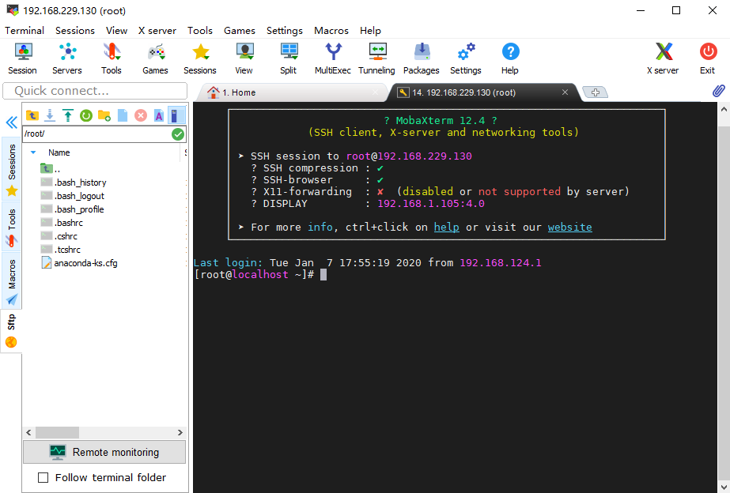

# CentOS 7虚拟机

## 安装

- 
- 
- 
- 
- 
- 
- 
- 
- 
- 
- 
- 
- 

## 登录和初始化

```
localhost login: root
Password:
Last Login: ...
[root@localhost ~]#
```

```bash
# 必备包（最小化安装后需要补充安装的包）
yum -y install net-tools wget

# 查看本机IP
cd /etc/sysconfig/network-scripts
ls -l ifcfg-*
vi ifcfg-ens33
# ONBOOT=yes
systemctl restart network
ifconfig
```

```
ens33: flags=4163<UP,BROADCAST,RUNNING,MULTICAST>  mtu 1500
        inet 192.168.229.130  netmask 255.255.255.0  broadcast 192.168.229.255
        ...
ens34: flags=4163<UP,BROADCAST,RUNNING,MULTICAST>  mtu 1500
        inet 192.168.124.133  netmask 255.255.255.0  broadcast 192.168.124.255
        ...
```

### 使用MobaXterm连接虚拟机

- 
- 

## 设置本地源

>确保真机HTTP服务启动，DVD-ISO文件挂载正常。

### 测试地址

```bash
# IP地址为真机适配器VMWare Network Adapter VMnet（Host-Only）的静态地址

# 测试1
ping -c 3 192.168.229.1

# 测试2
wget http://192.168.229.1/files/centos7/test; clear; more test; rm -f ./test
```

### 建立本地仓库

```
www/files/centos7
│  BUILD.bat
│  RPM-GPG-KEY-CentOS-7
│  RPM-GPG-KEY-CentOS-Testing-7
│  test
│
├─Packages
├─repodata
│      <sha256>-primary.xml.gz
│      <sha256>-other.sqlite.bz2
│      <sha256>-filelists.sqlite.bz2
│      <sha256>-c7-x86_64-comps.xml.gz
│      <sha256>-c7-x86_64-comps.xml
│      <sha256>-primary.sqlite.bz2
│      <sha256>-filelists.xml.gz
│      <sha256>-other.xml.gz
│      repomd.xml
│      repomd.xml.asc
│      TRANS.TBL
│
└─repofiles
        local.repo
```

#### *BUILD.bat*

```batch
REM 建立本地仓库

@SET DVD_ISO_DRIVE=G:
@SET VMNET_HOST_ONLY_DOMAIN=192.168.229.1
@SET HTTP_CENTOS_URL=/files/centos7

@ECHO OFF
CD /D %~dp0
IF NOT EXIST "%DVD_ISO_DRIVE%" (
    ECHO 没有挂载镜像文件！
    PAUSE>NUL
    EXIT
)

REM 建立测试文件
IF NOT EXIST .\test ECHO OK>.\test

REM 映射Packages
IF NOT EXIST .\Packages (
    MKLINK /J Packages "%DVD_ISO_DRIVE%\Packages"
) ELSE (
    RMDIR .\Packages 2>NUL && MKLINK /J Packages "%DVD_ISO_DRIVE%\Packages"
)

REM 拷贝RPM-GPG-KEY-CentOS
XCOPY /Y "%DVD_ISO_DRIVE%\RPM-GPG-KEY-CentOS*" .\

REM 拷贝repodata
IF NOT EXIST .\repodata (
    MKDIR .\repodata
    XCOPY "%DVD_ISO_DRIVE%\repodata" .\repodata
    REM 修正repodata
    PUSHD .\repodata
    ECHO Sub print^(item^):Wscript.Echo item:End Sub:Set XML = CreateObject^("Microsoft.XMLDOM"^):Set FSO = CreateObject^("Scripting.FileSystemObject"^):XML.load^("repomd.xml"^):Set objNodes = XML.SelectNodes^("/repomd/data"^):For Each objNode in objNodes:    h = objNode.SelectSingleNode^("./checksum"^).text:    h = Trim^(h^):    f = objNode.SelectSingleNode^("./location"^).GetAttributeNode^("href"^).nodevalue:    f = Trim^(Split^(f, "repodata/"^)^(1^)^):    If FSO.FileExists^(h^) Then:        print h:        FSO.MoveFile h, f:    End If:Next>.\_.vbs
    cscript .\_.vbs
    POPD
)

REM 建立仓库文件（用于wegt获取）
SET repo_url=http://%VMNET_HOST_ONLY_DOMAIN%%HTTP_CENTOS_URL%
set repo_gpgkey=RPM-GPG-KEY-CentOS-7
IF NOT EXIST .\repofiles (
    MKDIR .\repofiles
    PUSHD .\repofiles
    ECHO [LocalDVDISO]>.\local.repo
    ECHO name=Local DVD-ISO Packages>>.\local.repo
    ECHO baseurl=%repo_url%>>.\local.repo
    ECHO enabled=1 >>.\local.repo
    ECHO gpgcheck=1 >>.\local.repo
    ECHO gpgkey=%repo_url%/%repo_gpgkey%>>.\local.repo
)
ECHO Everything is OK.
PAUSE
```

### 虚拟机配置

```bash
cd '/etc/yum.repos.d'
if [ ! -d ./backups ]; then mkdir ./backups; mv ./CentOS-* ./backups 2>/dev/null || echo Nothing will be moved.; fi
# mv ./backups/CentOS-* ./; rmdir ./backups
wget -O ./DVD-ISO.repo  http://192.168.229.1/files/centos7/repofiles/local.repo
yum makecache
```

## 关闭SELINUX

```bash
# getenforce              #获取状态
# setenforce 0            #临时关闭
# vi /etc/selinux/config #永久关闭 SELINUX=disabled
sed -i '/SELINUX/s/enforcing/disabled/' '/etc/selinux/config'; more '/etc/selinux/config'
```
