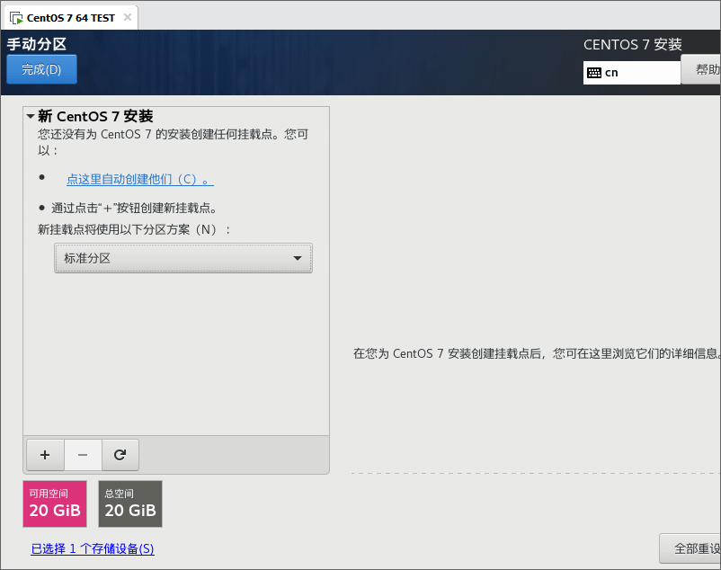

<link rel="stylesheet" href="https://zhmhbest.gitee.io/hellomathematics/style/index.css">
<script src="https://zhmhbest.gitee.io/hellomathematics/style/index.js"></script>

# [Install](../index.html)

[TOC]

## 安装CentOS

- 
- 
- 
- 
- 
- 
- 
- 
- 

## 软件

### 备份源

```bash
pushd '/etc/yum.repos.d'

# 备份当前源
if [ ! -d ./backups ]; then mkdir ./backups; cp ./CentOS-* ./backups 2>/dev/null || echo Nothing will be moved.; fi
ls -l

# 清空源配置
# rm -f ./*.repo

# 还原备份的源
# cp ./backups/CentOS-* ./
```

### 镜像源

```bash
# 加载镜像包
mkdir '/mnt/cdrom'
mount '/dev/cdrom' '/mnt/cdrom'

# 制作镜像目录
mkdir '/mnt/repo'
ln -s '/mnt/cdrom/Packages' '/mnt/repo/Packages'
cp -R '/mnt/cdrom/repodata/' '/mnt/repo/'

# 创建镜像源配置
echo -e "[local]\nname=local\nbaseurl=file:///mnt/repo\nenabled=1\ngpgcheck=0">'/etc/yum.repos.d/local.repo'

# 更新源缓存
yum clean all
yum makecache
yum repolist
```

### 网络源

添加**网络适配器**，使用**NAT**模式。

```bash
# CentOS-7 Aliyun
wget -O '/etc/yum.repos.d/CentOS-Base.repo' 'https://mirrors.aliyun.com/repo/Centos-7.repo'

# 更新源缓存
yum clean all
yum makecache
yum repolist
```

### 基本工具

```bash
yum -y install wget net-tools bzip2 zip unzip vim

# Or

cd '/mnt/cdrom/Packages'
rpm -ivh wget-*
rpm -ivh zip-*
rpm -ivh unzip-*
```

## 关闭SELINUX

```bash
# 开启
sed -i '/^SELINUX=/s/disabled/enforcing/' '/etc/selinux/config'
egrep '^SELINUX=' '/etc/selinux/config'
setenforce 1
getenforce

# 关闭
sed -i '/^SELINUX=/s/enforcing/disabled/' '/etc/selinux/config'
egrep '^SELINUX=' '/etc/selinux/config'
setenforce 0
getenforce
```

## 网络配置

### 开启网卡

```bash
# 获取网卡配置名称
# ls -l /etc/sysconfig/network-scripts/ifcfg-e*
ifcfg=$(echo /etc/sysconfig/network-scripts/ifcfg-e*)

# 查看网卡是否开启
egrep '^(DEVICE|ONBOOT)' $ifcfg

# 开启网卡
sed -i '/ONBOOT/s/no/yes/' $ifcfg

# 应用网卡配置
systemctl restart network
```

### 查看IP

```bash
ifconfig -a | grep 'inet ' | awk '{print $2}'
```

## 远程登录

使用[MobaXterm](https://mobaxterm.mobatek.net/download-home-edition.html)登录机器。

### X11-forwarding

```bash
yum -y install xorg-x11-xauth
yum -y install xorg-x11-apps
xclock
```

### SSH

```bash
# 使用密码
ssh -p 22 -l root 192.168.1.100
ssh -p 22 root@192.168.1.100

# 使用密钥
# %Userprofile%\.ssh\id_rsa
ssh -i "~/.ssh/id_rsa" -p 22 -l root 192.168.1.100
ssh -i "~/.ssh/id_rsa" -p 22 root@192.168.1.100
```

## 设置本地源

将安装镜像挂载为驱动器，并利用[Nginx](http://nginx.org/en/download.html)提供服务，使真机成为下载服务器。该步骤并非必要程序，进行此操作可在无网络环境下继续进行常用应用的安装。

### 获得真机地址（真机环境）

```batch
ipconfig

REM 以太网适配器 VMware Network Adapter VMnet1:
REM
REM    ...
REM    自动配置 IPv4 地址  . . . . . . . : <IP1>
REM    ...

REM 以太网适配器 VMware Network Adapter VMnet8:
REM
REM    ...
REM    自动配置 IPv4 地址  . . . . . . . : <IP2>
REM    ...

REM （管理员）允许真机被Ping
netsh advfirewall firewall add rule name="ICMP V4 Echo Request" protocol=icmpv4:8,any dir=in action=allow

REM （管理员）调试完成后删除规则
netsh advfirewall firewall delete rule name="ICMP V4 Echo Request"
```

### 建立本地仓库

- [`BUILD.cmd`](./codes/BUILD.cmd)

```txt
www/files/centos7
│  BUILD.bat                                    请下载
│  RPM-GPG-KEY-CentOS-7                         AUTO_COPY
│  RPM-GPG-KEY-CentOS-Testing-7                 AUTO_COPY
│  test                                         AUTO_BUILD
│
├─Packages                                      AUTO_LINK
├─repodata                                      AUTO_BUILD
│      <sha256>-primary.xml.gz
│      <sha256>-other.sqlite.bz2
│      <sha256>-filelists.sqlite.bz2
│      <sha256>-c7-x86_64-comps.xml.gz
│      <sha256>-c7-x86_64-comps.xml
│      <sha256>-primary.sqlite.bz2
│      <sha256>-filelists.xml.gz
│      <sha256>-other.xml.gz
│      repomd.xml
│      repomd.xml.asc
│      TRANS.TBL
│
└─repofiles
        local.repo                              AUTO_BUILD
```

### 测试真机地址（虚拟机环境）

```bash
# VMnet1.IP
rip=192.168.?.?

# 测试1
ping -c 3 $rip

# 测试2：启动Nginx后测试
wget http://$rip/files/centos7/test; clear; more test; rm -f ./test
```

### 配置虚拟机

```bash
cd '/etc/yum.repos.d'
wget -O ./CentOS-DVDISO.repo  http://$rip/files/centos7/repofiles/local.repo
yum makecache
```
