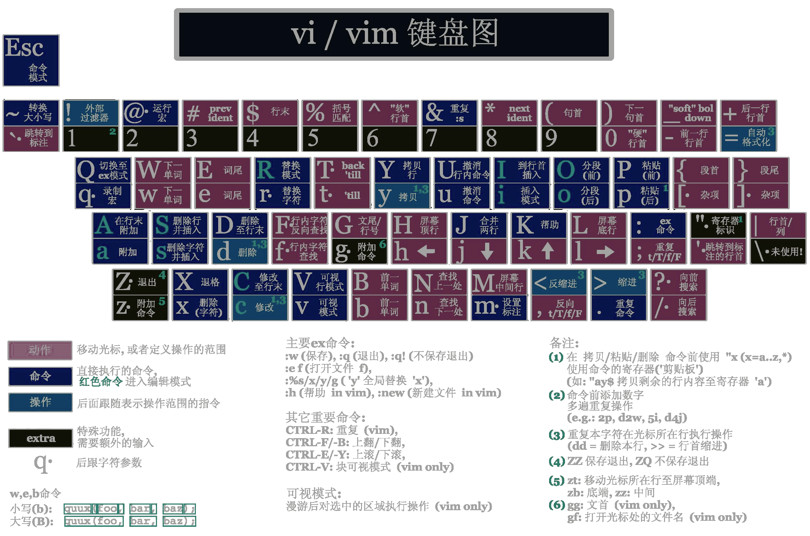

<link rel="stylesheet" href="https://zhmhbest.gitee.io/hellomathematics/style/index.css">

# [Vim](./index.html)

## 基本模式

- **Command mode**
  - `a`、`i`、`o`、`s`: 进入**Insert mode**
  - `A`、`I`、`O`、`S`: 进入**Insert mode**
  - `:`、`?`: 进入**Last line mode**
- **Insert mode**
  - `ESC`: 进入**Command mode**
- **Last line mode**
  - `ESC`: 进入**Command mode**
