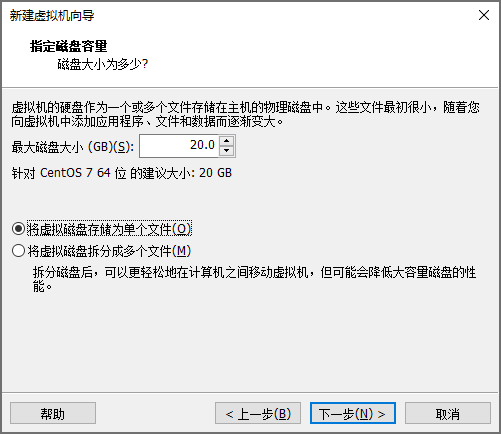
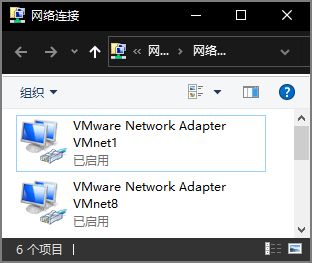
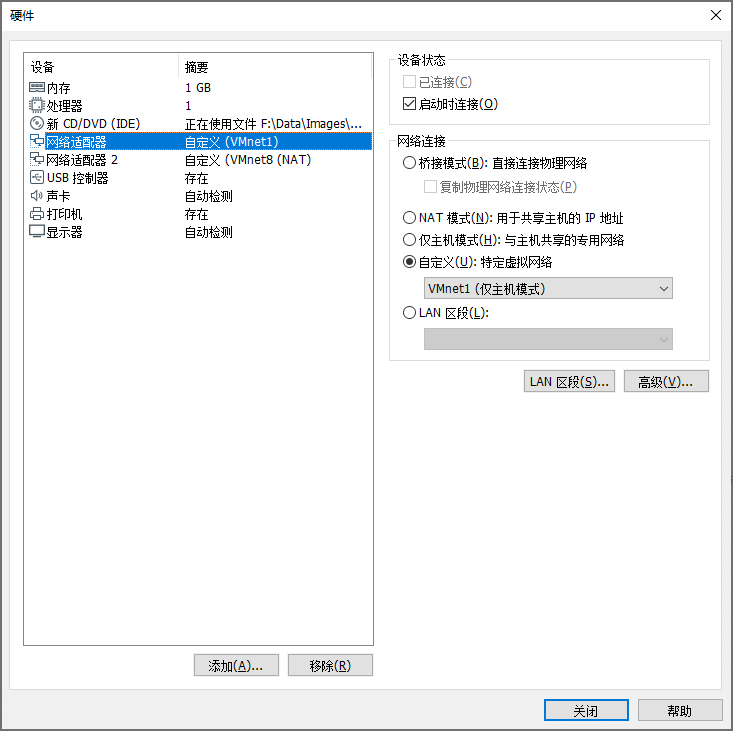
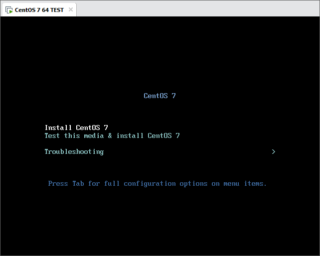
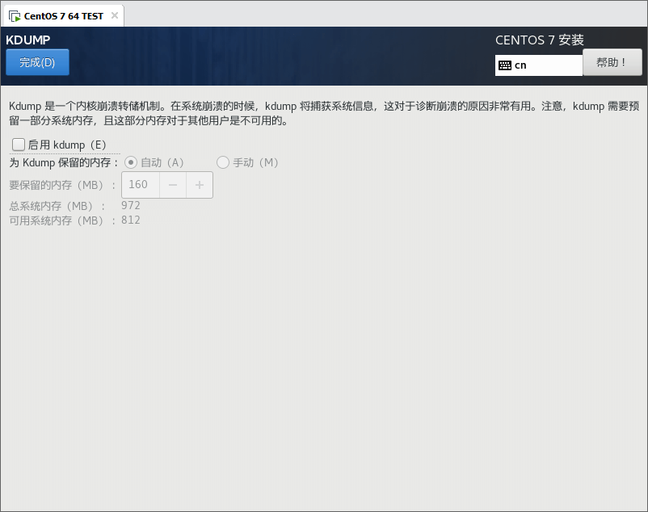
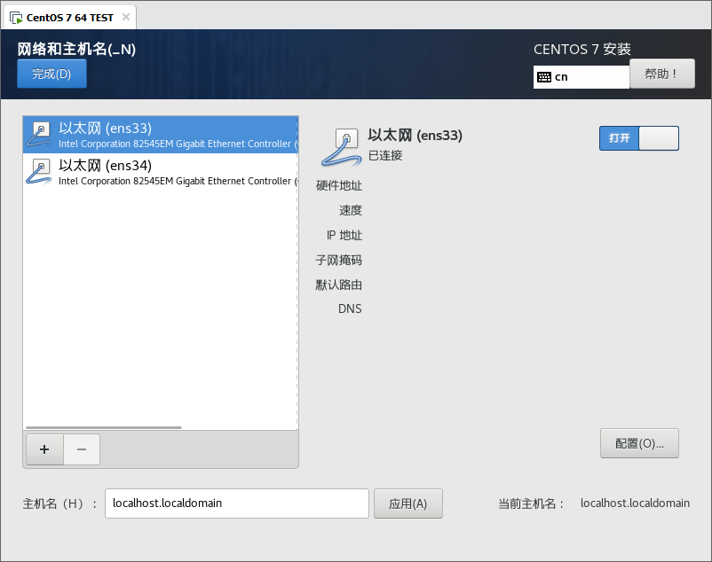
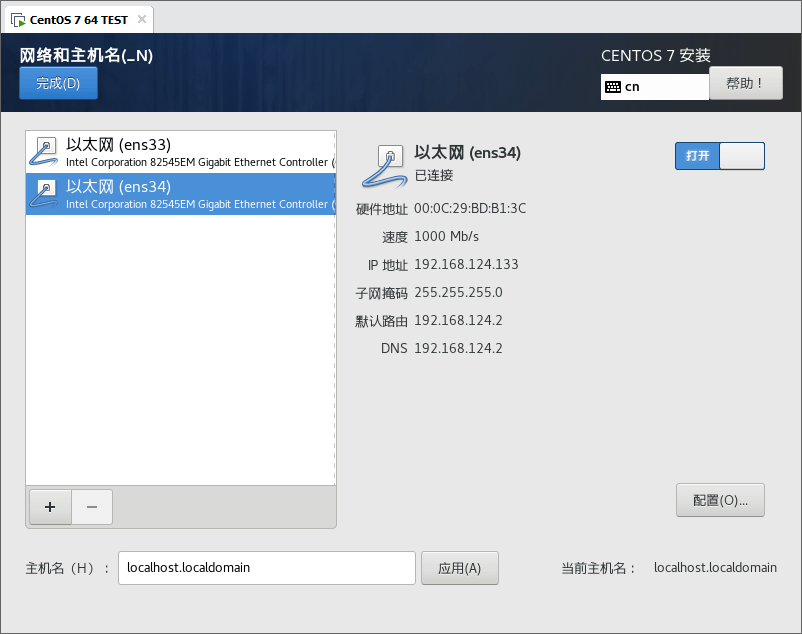
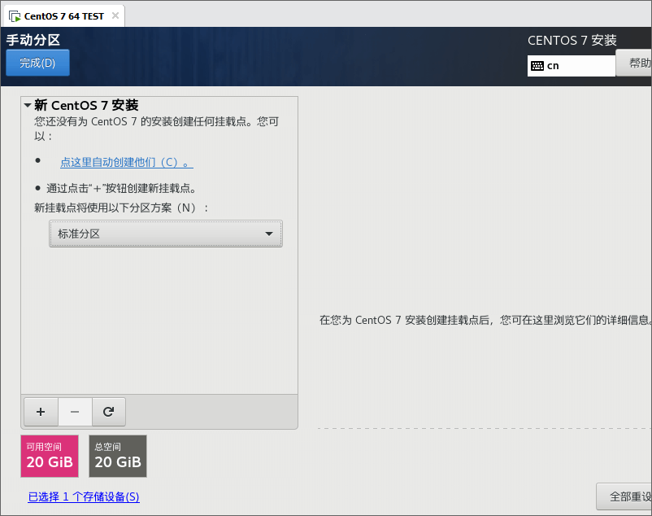
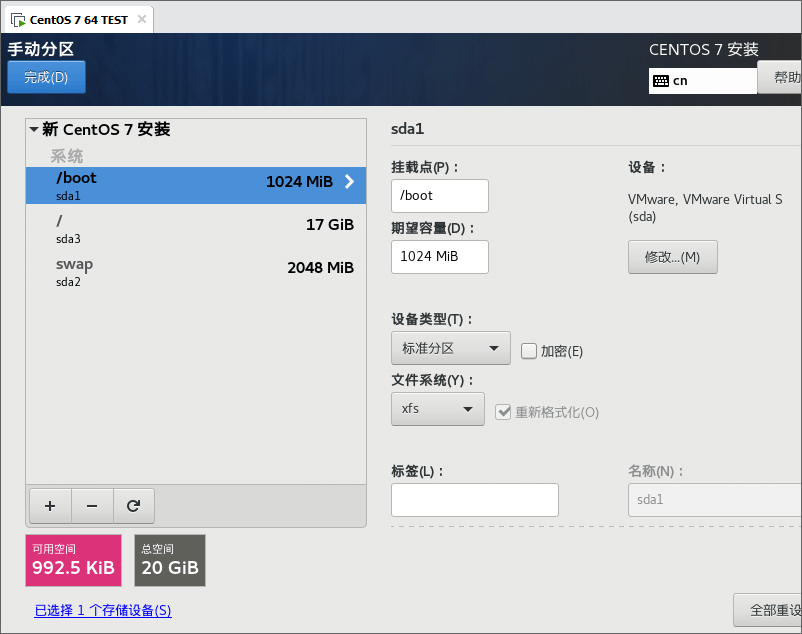
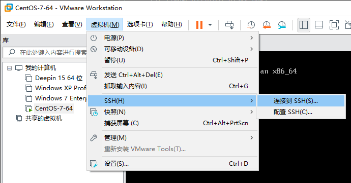

<link rel="stylesheet" href="https://zhmhbest.gitee.io/hellomathematics/style/index.css">
<script src="https://zhmhbest.gitee.io/hellomathematics/style/index.js"></script>

# [在VM上安装CentOS7](../index.html)

- 
- 
- 
- 
- 
- 
- 
- 
- 
- 
- 

## 获取虚拟机IP

获得虚拟机IP的目的是方便在真机环境中使用SSH协议登录。

```
localhost login: root
Password:
Last Login: ...
[root@localhost ~]#
```

```bash
cd /etc/sysconfig/network-scripts; ls -l ifcfg-*
# -rw-r--r--. 1 root root 279 6月  13 2020 ifcfg-ens33
# -rw-r--r--. 1 root root 254 3月  29 2019 ifcfg-lo
enscfg=ifcfg-ens33

tail -n 2 $enscfg
# DEVICE=ens33
# ONBOOT=no

sed -i '/ONBOOT/s/no/yes/' $enscfg
tail -n 2 $enscfg
# DEVICE=ens33
# ONBOOT=yes

systemctl restart network
yum -y install net-tools
ifconfig
```

```
ens33: flags=4163<UP,BROADCAST,RUNNING,MULTICAST>  mtu 1500
        inet 192.168.???.???  netmask *  broadcast *
        ...
```

## 关闭SELINUX

```bash
# getenforce                # 获取状态
# setenforce 0              # 临时关闭
# vi /etc/selinux/config    # 永久关闭 SELINUX=disabled
sed -i '/SELINUX/s/enforcing/disabled/' '/etc/selinux/config'
more '/etc/selinux/config'
```

## 设置本地源

将安装镜像挂载为驱动器，并利用[Nginx](http://nginx.org/en/download.html)提供服务，使真机成为下载服务器。

***Step1***：（真机环境）获得真机地址

```batch
ipconfig

REM 以太网适配器 VMware Network Adapter VMnet1:
REM 
REM    ...
REM    自动配置 IPv4 地址  . . . . . . . : <IP1>
REM    ...

REM 以太网适配器 VMware Network Adapter VMnet8:
REM 
REM    ...
REM    自动配置 IPv4 地址  . . . . . . . : <IP2>
REM    ...

REM （管理员）允许真机被Ping
netsh advfirewall firewall add rule name="ICMP V4 Echo Request" protocol=icmpv4:8,any dir=in action=allow

REM （管理员）调试完成后删除规则
netsh advfirewall firewall delete rule name="ICMP V4 Echo Request"
```

***Step2***：建立本地仓库

```
www/files/centos7
│  BUILD.bat                                    详见下文
│  RPM-GPG-KEY-CentOS-7                         AUTO_COPY
│  RPM-GPG-KEY-CentOS-Testing-7                 AUTO_COPY
│  test                                         AUTO_BUILD
│
├─Packages                                      AUTO_LINK
├─repodata                                      AUTO_BUILD
│      <sha256>-primary.xml.gz
│      <sha256>-other.sqlite.bz2
│      <sha256>-filelists.sqlite.bz2
│      <sha256>-c7-x86_64-comps.xml.gz
│      <sha256>-c7-x86_64-comps.xml
│      <sha256>-primary.sqlite.bz2
│      <sha256>-filelists.xml.gz
│      <sha256>-other.xml.gz
│      repomd.xml
│      repomd.xml.asc
│      TRANS.TBL
│
└─repofiles
        local.repo                              AUTO_BUILD
```

```batch
REM 【建立本地缓存】

REM Param1：镜像挂载磁盘
@SET DVD_ISO_DRIVE=G:
REM Param2：真机地址（VMnet1.IP）
@SET SERVER_DOMAIN=192.168.202.1
REM Param3：文件目录
@SET HTTP_CENTOS_URL=/files/centos7

@ECHO OFF
CD /D %~dp0
IF NOT EXIST "%DVD_ISO_DRIVE%" (
    ECHO 没有挂载镜像文件！
    PAUSE>NUL
    EXIT
)

REM 建立测试文件
IF NOT EXIST .\test ECHO OK>.\test

REM 映射Packages
IF NOT EXIST .\Packages (
    MKLINK /J Packages "%DVD_ISO_DRIVE%\Packages"
) ELSE (
    RMDIR .\Packages 2>NUL && MKLINK /J Packages "%DVD_ISO_DRIVE%\Packages"
)

REM 拷贝RPM-GPG-KEY-CentOS
XCOPY /Y "%DVD_ISO_DRIVE%\RPM-GPG-KEY-CentOS*" .\

REM 拷贝repodata
IF NOT EXIST .\repodata (
    MKDIR .\repodata
    XCOPY "%DVD_ISO_DRIVE%\repodata" .\repodata
    REM 修正repodata
    PUSHD .\repodata
    ECHO Sub print^(item^):Wscript.Echo item:End Sub:Set XML = CreateObject^("Microsoft.XMLDOM"^):Set FSO = CreateObject^("Scripting.FileSystemObject"^):XML.load^("repomd.xml"^):Set objNodes = XML.SelectNodes^("/repomd/data"^):For Each objNode in objNodes:    h = objNode.SelectSingleNode^("./checksum"^).text:    h = Trim^(h^):    f = objNode.SelectSingleNode^("./location"^).GetAttributeNode^("href"^).nodevalue:    f = Trim^(Split^(f, "repodata/"^)^(1^)^):    If FSO.FileExists^(h^) Then:        print h:        FSO.MoveFile h, f:    End If:Next>.\_.vbs
    cscript .\_.vbs
    POPD
)

REM 建立仓库文件（用于wegt获取）
SET repo_url=http://%SERVER_DOMAIN%%HTTP_CENTOS_URL%
set repo_gpgkey=RPM-GPG-KEY-CentOS-7
IF NOT EXIST .\repofiles (
    MKDIR .\repofiles
    PUSHD .\repofiles
    ECHO [LocalDVDISO]>.\local.repo
    ECHO name=Local DVD-ISO Packages>>.\local.repo
    ECHO baseurl=%repo_url%>>.\local.repo
    ECHO enabled=1 >>.\local.repo
    ECHO gpgcheck=1 >>.\local.repo
    ECHO gpgkey=%repo_url%/%repo_gpgkey%>>.\local.repo
)
ECHO Everything is OK.
PAUSE
```

***Step3***：（虚拟机环境）测试真机地址

```bash
# VMnet1.IP
rip=192.168.202.1

# 测试1
ping -c 3 $rip

# 测试2：启动Nginx后测试
yum -y install wget
wget http://$rip/files/centos7/test; clear; more test; rm -f ./test
```

***Step4***：配置虚拟机

```bash
cd '/etc/yum.repos.d'
if [ ! -d ./backups ]; then mkdir ./backups; mv ./CentOS-* ./backups 2>/dev/null || echo Nothing will be moved.; fi
# mv ./backups/CentOS-* ./; rmdir ./backups
wget -O ./DVD-ISO.repo  http://$rip/files/centos7/repofiles/local.repo
yum makecache
```
