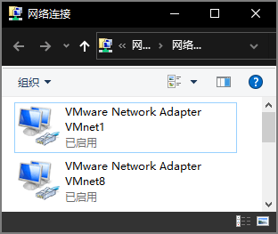
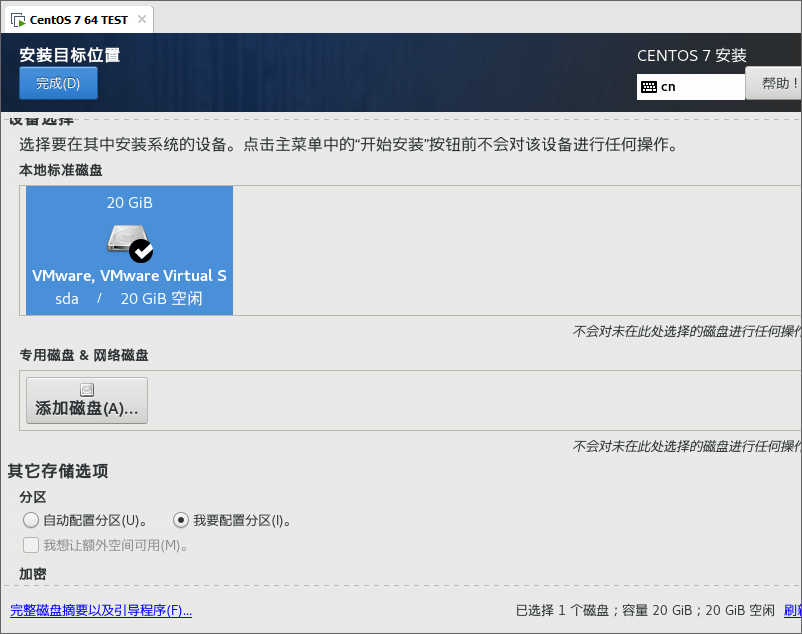

<link rel="stylesheet" href="https://zhmhbest.gitee.io/hellomathematics/style/index.css">
<script src="https://zhmhbest.gitee.io/hellomathematics/style/index.js"></script>

# [在VM上安装CentOS7](../index.html)

[TOC]

## 安装CentOS

- 
- 
- 
- 
- 
- 
- 
- 
- 
- 

## 安装基本工具

```bash
# 加载镜像包
if [ ! -d '/mnt/cdrom' ]; then mkdir '/mnt/cdrom'; mount '/dev/cdrom' '/mnt/cdrom'; fi
cd '/mnt/cdrom/Packages'

# 必备软件
rpm -ivh wget-*
rpm -ivh net-tools-*
```

## 查看IP地址

### 开启网卡

```bash
# 获取网卡配置名称
# ls -l /etc/sysconfig/network-scripts/ifcfg-e*
ifcfg=$(echo /etc/sysconfig/network-scripts/ifcfg-e*)
echo $ifcfg

# 查看网卡是否开启
tail $ifcfg -n 2
# DEVICE=ens33
# ONBOOT=no

# 开启网卡
sed -i '/ONBOOT/s/no/yes/' $ifcfg
tail $ifcfg -n 2
# DEVICE=ens33
# ONBOOT=yes

# 应用网卡配置
systemctl restart network
```

### 查看IP

```bash
ifconfig -a | grep 'inet 192.'
```

## 远程登录


也可使用[MobaXterm](https://mobaxterm.mobatek.net/download-home-edition.html)（[`MobaStart.cmd`](./codes/MobaStart.cmd)）登录。

## 关闭SELINUX

```bash
# getenforce                # 获取状态
# setenforce 0              # 临时关闭
# vi /etc/selinux/config    # 永久关闭 SELINUX=disabled
sed -i '/SELINUX/s/enforcing/disabled/' '/etc/selinux/config'
more '/etc/selinux/config'
# 重启后生效
```

## 配置境内源

添加**网络适配器**，使用**net**模式。

```bash
# 备份当前源
cd '/etc/yum.repos.d'
if [ ! -d ./backups ]; then mkdir ./backups; mv ./CentOS-* ./backups 2>/dev/null || echo Nothing will be moved.; fi
# mv ./backups/CentOS-* ./; rmdir ./backups

# Aliyun源
wget -O ./Aliyun-Base.repo http://mirrors.aliyun.com/repo/Centos-7.repo
wget -O ./Aliyun-epel.repo http://mirrors.aliyun.com/repo/epel-7.repo

# Remi源（包含最新版本PHP和MySQL）
# yum install -y http://rpms.remirepo.net/enterprise/remi-release-7.rpm

# Repoforge源
# https://mirrors.tuna.tsinghua.edu.cn/help/repoforge/
# http://repoforge.org/use/

# 更新源缓存
yum clean all
yum makecache
yum repolist
```

## 设置本地源

将安装镜像挂载为驱动器，并利用[Nginx](http://nginx.org/en/download.html)提供服务，使真机成为下载服务器。该步骤并非必要程序，进行此操作可在无网络环境下继续进行常用应用的安装。

### 获得真机地址（真机环境）

```batch
ipconfig

REM 以太网适配器 VMware Network Adapter VMnet1:
REM
REM    ...
REM    自动配置 IPv4 地址  . . . . . . . : <IP1>
REM    ...

REM 以太网适配器 VMware Network Adapter VMnet8:
REM
REM    ...
REM    自动配置 IPv4 地址  . . . . . . . : <IP2>
REM    ...

REM （管理员）允许真机被Ping
netsh advfirewall firewall add rule name="ICMP V4 Echo Request" protocol=icmpv4:8,any dir=in action=allow

REM （管理员）调试完成后删除规则
netsh advfirewall firewall delete rule name="ICMP V4 Echo Request"
```

### 建立本地仓库

- [`BUILD.cmd`](./codes/BUILD.cmd)

```txt
www/files/centos7
│  BUILD.bat                                    详见下文
│  RPM-GPG-KEY-CentOS-7                         AUTO_COPY
│  RPM-GPG-KEY-CentOS-Testing-7                 AUTO_COPY
│  test                                         AUTO_BUILD
│
├─Packages                                      AUTO_LINK
├─repodata                                      AUTO_BUILD
│      <sha256>-primary.xml.gz
│      <sha256>-other.sqlite.bz2
│      <sha256>-filelists.sqlite.bz2
│      <sha256>-c7-x86_64-comps.xml.gz
│      <sha256>-c7-x86_64-comps.xml
│      <sha256>-primary.sqlite.bz2
│      <sha256>-filelists.xml.gz
│      <sha256>-other.xml.gz
│      repomd.xml
│      repomd.xml.asc
│      TRANS.TBL
│
└─repofiles
        local.repo                              AUTO_BUILD
```

### 测试真机地址（虚拟机环境）

```bash
# VMnet1.IP
rip=192.168.202.1

# 测试1
ping -c 3 $rip

# 测试2：启动Nginx后测试
wget http://$rip/files/centos7/test; clear; more test; rm -f ./test
```

### 配置虚拟机

```bash
cd '/etc/yum.repos.d'
wget -O ./CentOS-Base-DVDISO.repo  http://$rip/files/centos7/repofiles/local.repo
yum makecache
```
